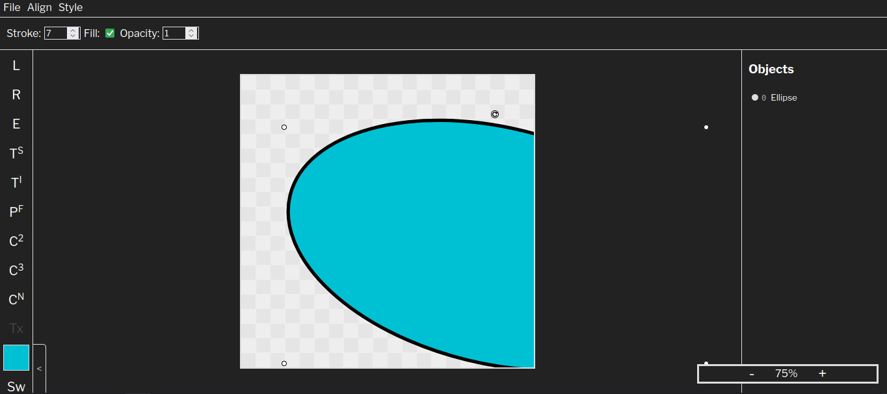

# hridPaint

hridPaint is an open-source vector graphic and photo editor. It is very minimalistic and easy to use, but has a surprising amount of power packed in. No more using MS Paint!

## Features

- Shapes (rectangles, triangles, polygons, ellipses, lines, quadratic & cubic curves)
- Images
- Fill/stroke color and width
- Canvas zoom
- Adjustable canvas size
- PNG, JPEG, WEBP, SVG export
- Project file export
- Alignment/distribution tools
- Object reordering
- Effects (Blur, shadow, lighting, filters, adjustments, etc.)

## Local development

To set up for local development, follow these steps:

1. Install Python 3.xx on your system
2. Install the Flask module (`pip install flask` or `sudo apt install python3-flask`)
3. Clone the repository
4. Run app.py and go to 127.0.0.1:5000 for the local server

You can also use the Live Server extension on Visual Studio Code, and navigate to `/templates/index.html` to have an auto-reloading local frontend @ 127.0.0.1:5500.

## Notes

Since this is a vector editor, there is no pixel and fill support.

Made with <3 by Hridhaan Shetty
